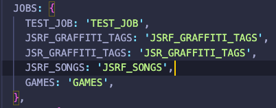
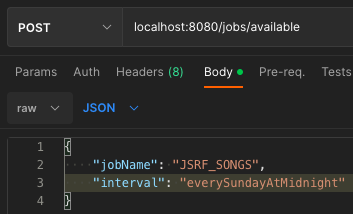
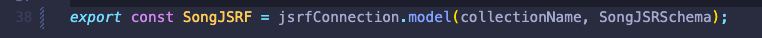
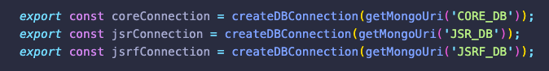
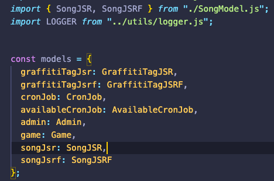
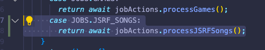
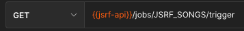

# New Data Point Setup

The example data point used in this guide is ```JSRF_SONGS```

- [New Data Point Setup](#new-data-point-setup)
    - [Creating the CronJob](#creating-the-cronjob)
    - [Creating the Model](#creating-the-model)
    - [Creating the Processor](#creating-the-processor)
    - [Link Processor to CronJob Trigger](#link-processor-to-cronjob-trigger)
    - [Test Data Ingestion](#test-data-ingestion)
    - [Create public API endpoint](#create-public-api-endpoint)

### Creating the CronJob

 - Add JobName to src/constants/Constants.js file under "JOBS" <br />
  <br />
 -  Start up qa server, and add Job to mongo by using the [createAvailableJob](../routes/jobsRouter.js) endpoint(```line 10```). You will need to add the cronInterval(this can be changed later). See a list of [available intervals](./intervals.js) to use. The timezone is not required. If the timezone is not specified it will default to ```America/Chicago```. Make sure the jobName matches the name in the Constants file. <br />
  <br />
 -  Verify your cronJob was created by running the [GetAvailableJob route](../routes/jobsRouter.js) or just check in mongo.
 - Now your CronJob is set up! But if you start it now, it won't actually do anything when it executes until we complete a few more steps.

### Creating the Model

The Model for each data point is a mongoose Model built off of a defined Schema. You can find them all under src/models.

 -  Create a new Model file for your data point at this location.
 -  Pay close attention to the collectionName as the naming convention should match others.
 -  Make sure to add the collection to the correct database.<br />
  <br />

  A LIST of available [databases](../config/db.js) to choose from.<br />
  <br />

 - Add your new model(s) to the models object in the [BaseModel](../models/BaseModel.js) file to be able to use the global functions to more easily interact with the DB.<br />
  <br />
  


### Creating the Processor 

The processors for jobs are found under src/jobs/processors. 

 - Create a file under the appropriate location for your processor. For this example, songs.js will go in the processors/jsrf folder.
 -  Write your processing logic. This is where you will extract data from an external location, transform it, and save it to the Database using the new model you created.
 -  [Axios](https://github.com/axios/axios) and [Cheerio](https://github.com/cheeriojs/cheerio) are already installed as dependencies and can both be used to acheive almost anything you want to do here. If you want to manually create a file to ingest from, that is fine. If you do, please put it under src/storage and use JSON format if possible.


### Link Processor to CronJob Trigger

Now it's time to link the cron job fire event to our processor. The hard work is done for you, all you need to do it tell it which processor to look for!

 -  Import your processor into the [JobInterchanger](./jobInterchanger.js).
 -  Add the processor function into the JobActions object located at the bottom of the file.
 -  Set up a new switch case pointing to the new function you added as a JobAction.<br />
  <br />


### Test Data Ingestion

 - This will likely be the longest step because as you find bugs in your processor, you will have to go back and edit the processor and test again.
 - Test your job by [triggering it](../routes/jobsRouter.js) passing in the jobName in the params.<br/>
  <br />
 - Verify that the data flows correctly into mongo. Make sure to add checks to prevent any duplicates from being added when the job runs again.
 - Verify you can create, stop, and trigger the new job. As an extra layer, you can make sure your job is included when the [START_ALL](../routes/jobsRouter.js) and [STOP_ALL](../routes/jobsRouter.js) routes are fired.


### Create public API endpoint

 - Create the public API endpoint in [JetSetRadio-API](https://github.com/Jet-Set-Radio-API/JetSetRadio-API)
 - This will pull ALL the data you ingested into mongo for public API users to consume.
